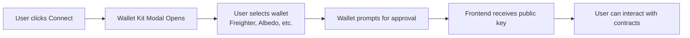

<div align="center">

# 🌌 Orion Protocol — Frontend

**Production-ready React application for RWA tokenization, staking, and DeFi lending on Stellar/Soroban**

[](https://www.typescriptlang.org/)
[](https://reactjs.org/)
[](https://vitejs.dev/)
[](https://stellar.org/)

[Live Demo](#) • [Documentation](#) • [Report Bug](#)

</div>

---

## 📋 Table of Contents

- [What is Orion?](#-what-is-orion)
- [Tech Stack](#-tech-stack)
- [Quick Start](#-quick-start)
- [Project Structure](#-project-structure)
- [Stellar Wallet Integration](#-stellar-wallet-integration)
- [User Flows](#-user-flows)
- [Contract Architecture](#-contract-architecture)
- [Development Notes](#-development-notes)
- [Troubleshooting](#-troubleshooting)

---

## 🎯 What is Orion?

Orion is a decentralized protocol for tokenizing real-world assets (RWAs) and using them as collateral for loans. The frontend provides a clean, intuitive interface for:

- **Minting** RWA tokens (Invoices, T-Bills, Real Estate)
- **Staking** RWA tokens to earn yield and receive stRWA receipts
- **Borrowing** USDC against stRWA collateral
- **Managing** positions with real-time health monitoring

Built on Stellar's Soroban smart contract platform, Orion combines the security of blockchain with the familiarity of traditional finance.

---

## 🛠 Tech Stack

### Core Technologies

| Technology | Purpose | Version |
|------------|---------|---------|
| **React** | UI framework | 18.3.x |
| **TypeScript** | Type safety | 5.5.x |
| **Vite** | Build tool & dev server | 5.4.x |
| **Tailwind CSS** | Styling | 3.4.x |
| **Stellar SDK** | Blockchain interactions | Latest |
| **Stellar Wallet Kit** | Wallet connection | Latest |

### Key Libraries

- **Radix UI** — Accessible component primitives
- **Lucide React** — Icon system
- **Sonner** — Toast notifications
- **React Router** — Client-side routing

---

## 🚀 Quick Start

### Prerequisites

Before you begin, make sure you have:

- **Node.js** 18+ (LTS recommended)
- **npm** or **pnpm**
- A **Stellar wallet** (Freighter recommended for testing)

### Installation

```bash
# Clone the repo
git clone https://github.com/Orion-LB/Scaffold-Stellar-Orion-Server.git
cd Scaffold-Stellar-Orion-Server/orion

# Install dependencies
npm install

# Start development server
npm run dev
```

The app will open at `http://localhost:5173`

### Building for Production

```bash
# Create optimized build
npm run build

# Preview production build locally
npm run preview
```

Build output will be in `dist/` — ready to deploy to any static hosting provider (Vercel, Netlify, AWS S3, etc.)

---

## 📁 Project Structure

```
orion/
├── src/
│   ├── components/          # React components
│   │   ├── dashboard/       # Main app screens (Stake, Borrow, Profile)
│   │   ├── modals/          # Dialogs (GetRWA, transaction confirmations)
│   │   └── ui/              # Reusable UI components (Button, Card, etc.)
│   │
│   ├── services/            # Business logic layer
│   │   └── contracts/       # Soroban contract clients
│   │       ├── ContractService.ts       # Base contract interaction class
│   │       ├── MockRWAService.ts        # RWA token operations
│   │       ├── VaultService.ts          # Staking vault operations
│   │       ├── LendingPoolService.ts    # Borrow/repay operations
│   │       └── index.ts                 # Contract address registry
│   │
│   ├── hooks/               # React hooks
│   │   ├── useContractServices.ts       # Contract service instances
│   │   └── useStellarWallet.ts          # Wallet connection logic
│   │
│   ├── lib/                 # Utilities
│   │   └── localStorage.ts  # Local state management
│   │
│   └── types/               # TypeScript definitions
│
├── contracts/contracts/     # Smart contract ABIs & addresses
│   └── deployed-addresses.json          # Testnet contract addresses
│
└── bots/config/             # Backend bot configuration
    └── testnet.json         # Oracle/liquidation bot addresses
```

---

## 🔐 Stellar Wallet Integration

### How it Works

The app uses **Stellar Wallet Kit** to connect with user wallets. Here's the flow:



### Code Pattern

Every contract interaction follows this pattern:

```typescript
// 1. Get wallet provider from context
const { wallet } = useContractServices();

// 2. Create provider object for contract service
const walletProvider = wallet.isConnected ? {
  address: wallet.address!,
  networkPassphrase: wallet.networkPassphrase,
  signTransaction: wallet.signTransaction,
} : undefined;

// 3. Initialize contract service with wallet
const rwaService = createMockRWAServiceFromAddress(
  assetConfig.rwa, 
  walletProvider
);

// 4. Call contract method
const result = await rwaService.mint_rwa_tokens(userAddress, amount, walletProvider);
```

### Security

- ✅ **No private keys in frontend** — Wallet handles all signing
- ✅ **User confirms every transaction** — Explicit approval required
- ✅ **Read-only by default** — Write operations need wallet signature

---

## 🎨 User Flows

### Flow 1: Get RWA Tokens

```
┌─────────────────┐
│  User Profile   │
└────────┬────────┘
         │
         │ Clicks "Get RWA"
         ▼
┌─────────────────┐
│  Select Asset   │ ← Invoices, T-Bills, or Real Estate
└────────┬────────┘
         │
         │ Enter amount
         ▼
┌─────────────────┐
│ Confirm in      │
│ Wallet          │ ← Freighter popup
└────────┬────────┘
         │
         │ Sign transaction
         ▼
┌─────────────────┐
│ ✓ Tokens Minted │
│ Balance Updated │
└─────────────────┘
```

**Contract calls:**
1. `rwaService.mint_rwa_tokens(user, amount)` — Mints tokens and auto-whitelists user

---

### Flow 2: Stake RWA Tokens

```
┌─────────────────┐
│  Dashboard      │
│  "Stake Assets" │
└────────┬────────┘
         │
         │ Select asset type
         ▼
┌─────────────────┐
│  Enter amount   │
└────────┬────────┘
         │
         │ Step 1: Approve
         ▼
┌─────────────────┐
│ Approve vault   │ ← Allow vault to spend RWA tokens
│ to spend tokens │
└────────┬────────┘
         │
         │ Step 2: Stake
         ▼
┌─────────────────┐
│ Stake tokens    │ ← Vault transfers RWA, mints stRWA 1:1
└────────┬────────┘
         │
         ▼
┌─────────────────┐
│ ✓ Staking Done  │
│ Receive stRWA   │ ← Platform tokens for borrowing
└─────────────────┘
```

**Contract calls:**
1. `rwaService.approve(from, vault, amount, expiration_ledger)` — Approve vault
2. `vaultService.stake(user, amount)` — Transfer RWA and receive stRWA

---

### Flow 3: Borrow Against Collateral

```
┌─────────────────┐
│  Dashboard      │
│  "Borrow" tab   │
└────────┬────────┘
         │
         │ Select stRWA collateral
         ▼
┌─────────────────┐
│ Choose amount   │ ← Max based on collateral value
│ & duration      │
└────────┬────────┘
         │
         │ Step 1: Approve
         ▼
┌─────────────────┐
│ Approve lending │ ← Allow pool to spend stRWA
│ pool            │
└────────┬────────┘
         │
         │ Step 2: Originate
         ▼
┌─────────────────┐
│ Create loan     │ ← Pool locks collateral, transfers USDC
└────────┬────────┘
         │
         ▼
┌─────────────────┐
│ ✓ Loan Active   │
│ USDC in wallet  │
└─────────────────┘
```

**Contract calls:**
1. `stRwaService.approve(from, lendingPool, amount, expiration_ledger)` — Approve collateral
2. `lendingPoolService.originate_loan(borrower, collaterals, loan_amount, duration)` — Create loan

---

## 🏗 Contract Architecture

### Contract Addresses (Stellar Testnet)

All contracts are deployed on Stellar Testnet. Addresses are stored in `contracts/contracts/deployed-addresses.json`.

#### RWA Token Contracts

| Asset | Contract ID | Decimals |
|-------|-------------|----------|
| **Invoices** | `CBFKZAVQ57FUW...` | 18 |
| **T-Bills** | `CD3ZKDA3VG4PQ...` | 18 |
| **Real Estate** | `CCSCN4NNINMSE...` | 18 |

#### Vault Contracts (Staking Pools)

| Vault | Contract ID | Linked Assets |
|-------|-------------|---------------|
| **Invoices Vault** | `CCYADH4LWFOIR...` | RWA ↔ stRWA |
| **T-Bills Vault** | `CAFQWK3D3QLMG...` | RWA ↔ stRWA |
| **Real Estate Vault** | `CAGUJJGFK7N5W...` | RWA ↔ stRWA |

#### Core Infrastructure

| Contract | Purpose | Address |
|----------|---------|---------|
| **Mock USDC** | Test stablecoin | `CAXHQJ6IHN2TP...` |
| **Oracle** | Price feeds | `CDQ3C3T477QZF...` |
| **Lending Pool** | Borrow/repay | `CCW2TFZ7DWNMO...` |

### Architecture Diagram

```
┌───────────────────────────────────────────────────────────┐
│                     Frontend (React)                       │
│  ┌─────────────┐  ┌─────────────┐  ┌─────────────┐       │
│  │  Dashboard  │  │   Modals    │  │  Services   │       │
│  └──────┬──────┘  └──────┬──────┘  └──────┬──────┘       │
│         │                 │                 │              │
│         └─────────────────┴─────────────────┘              │
│                           │                                │
│                  ┌────────▼────────┐                       │
│                  │ Contract        │                       │
│                  │ Services        │                       │
│                  └────────┬────────┘                       │
└───────────────────────────┼───────────────────────────────┘
                            │
                   Stellar SDK
                            │
┌───────────────────────────▼───────────────────────────────┐
│              Stellar/Soroban Blockchain                    │
│  ┌─────────┐  ┌─────────┐  ┌─────────┐  ┌─────────┐      │
│  │   RWA   │  │  Vault  │  │  stRWA  │  │ Lending │      │
│  │ Tokens  │  │Contracts│  │ Tokens  │  │  Pool   │      │
│  └─────────┘  └─────────┘  └─────────┘  └─────────┘      │
└───────────────────────────────────────────────────────────┘
```

---

## 💻 Development Notes

### Working with Contract Services

Contract services are TypeScript classes that wrap Soroban contract interactions. Each service extends `ContractService` base class.

**Example: Minting RWA tokens**

```typescript
// services/contracts/MockRWAService.ts
async mint_rwa_tokens(
  to: string, 
  amount: bigint, 
  wallet?: StellarWalletProvider
): Promise<TransactionResult> {
  return await this.invokeContract(
    'mint_rwa_tokens',
    { to, amount },
    wallet
  );
}
```

**Base ContractService handles:**
- Transaction building
- Simulation (gas estimation)
- Signing via Wallet Kit
- Submission to Soroban RPC
- Error handling

### Simulation Fallbacks

For demo/testing purposes, the frontend includes simulation fallbacks when contract calls fail due to:

- Missing functions in deployed WASM
- User not whitelisted (requires admin action)
- Contract initialization issues

**Example from MockRWAService:**

```typescript
// If approve fails with Error #102 (not whitelisted)
if (errorStr.includes('Error(Contract, #102)')) {
  console.warn('⚠️  WORKAROUND: Simulating approval for demo');
  return {
    success: true,
    transactionHash: `SIM_APPROVE_${Date.now()}`,
    result: null
  };
}
```

All simulated transactions are clearly logged and use `SIM_` prefixed transaction hashes.

> **Production note:** Remove simulation fallbacks when contracts are properly deployed and users are whitelisted.

### Local State Management

The app uses localStorage to maintain UI consistency:

```typescript
// lib/localStorage.ts
export function simulateStake(
  address: string, 
  assetType: AssetType, 
  amount: bigint
) {
  const profile = getProfile(address);
  profile.assetBalances[assetType].rwaBalance -= amount;
  profile.assetBalances[assetType].stRwaBalance += amount;
  saveProfile(address, profile);
}
```

This ensures the UI reflects user actions even when blockchain state updates are delayed or simulated.

---

## 🐛 Troubleshooting

### Common Errors

#### `Error(Contract, #102)` — User Not Whitelisted

**Cause:** RWA token contracts enforce a whitelist. User tried to approve/transfer without being whitelisted.

**Solution:**
```bash
# Admin must whitelist user
stellar contract invoke \
  --id <RWA_CONTRACT_ID> \
  --source-account <ADMIN_ACCOUNT> \
  --network testnet \
  -- allow_user \
    --user <USER_ADDRESS> \
    --operator <ADMIN_ADDRESS>
```

---

#### `MissingValue` or `non-existent contract function`

**Cause:** Contract WASM doesn't include the function the frontend is trying to call.

**Solution:**
1. Rebuild contract from correct source
2. Redeploy to Soroban testnet
3. Update `contracts/contracts/deployed-addresses.json`
4. Restart frontend

---

#### `UnreachableCodeReached` — Stake Panics

**Cause:** Vault contract hit a panic condition, usually:
- Insufficient allowance
- User not whitelisted
- Contract not initialized

**Solution:**
1. Ensure user approved vault to spend tokens
2. Check whitelist status
3. Verify vault `initialize` was called

---

#### Wallet Not Connecting

**Symptoms:** "Connect Wallet" button does nothing

**Solutions:**
- Install Freighter extension: https://freighter.app
- Ensure browser extension permissions are granted
- Try clearing browser cache
- Check console for Wallet Kit errors

---

### Debugging Tools

#### Browser Console

All contract interactions log to console:

```
🪙 Attempting to mint 100 RWA tokens to GABC...
📝 Contract: CBFKZAVQ57...
🔑 Signer: GABC...
✅ mint_rwa_tokens() succeeded! TX: ABC123...
```

#### Soroban CLI

Test contract calls directly:

```bash
stellar contract invoke \
  --id <CONTRACT_ID> \
  --source-account <ACCOUNT> \
  --network testnet \
  -- <FUNCTION_NAME> \
    --param1 value1 \
    --param2 value2
```

#### Network Inspector

Monitor RPC calls in browser DevTools → Network tab:
- Look for `POST` to `https://soroban-testnet.stellar.org`
- Check request/response for transaction details

---

## 📚 Additional Resources

- **Stellar Documentation:** https://developers.stellar.org
- **Soroban Docs:** https://soroban.stellar.org
- **Stellar Wallet Kit:** https://github.com/stellar/stellar-wallets-kit
- **Contract API Reference:** See `ContractAPI.md` in backend docs

---

## 🤝 Contributing

Found a bug or want to contribute? Here's how:

1. Fork the repo
2. Create a feature branch (`git checkout -b feature/amazing-feature`)
3. Commit changes (`git commit -m 'Add amazing feature'`)
4. Push to branch (`git push origin feature/amazing-feature`)
5. Open a Pull Request

---

<div align="center">

**Built with ❤️ by the Orion team**

</div>

